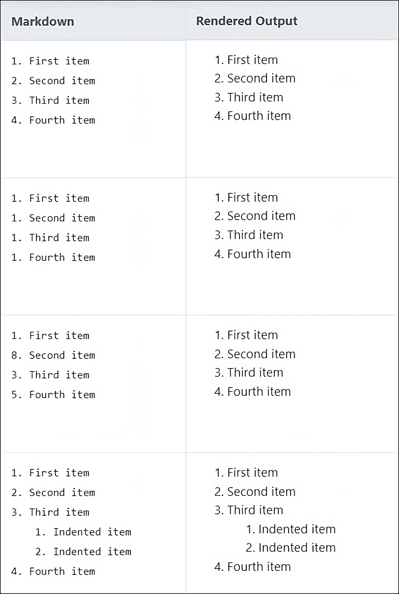
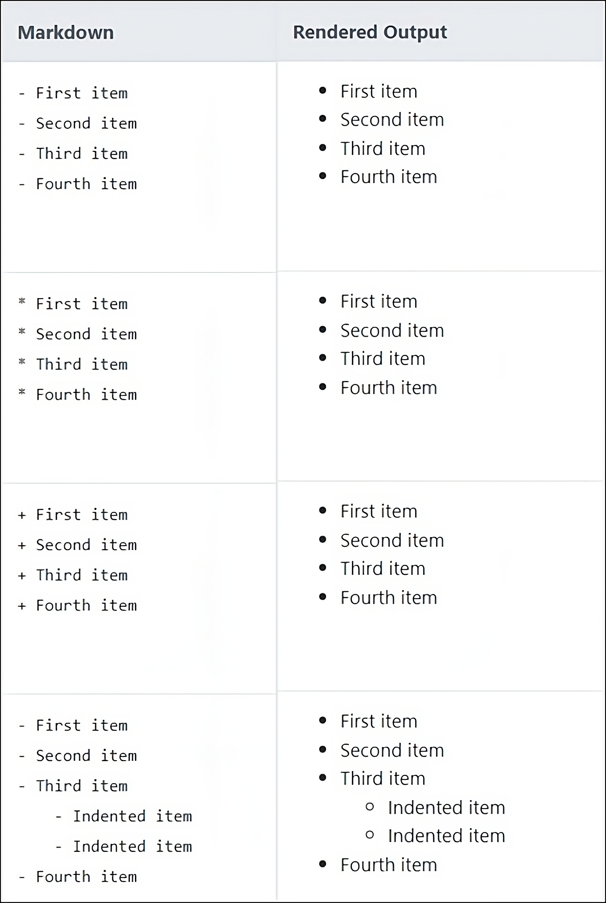
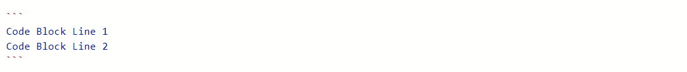

# How to use Markdown Language to Author Lab Guides

## Overview

**Markdown** is a lightweight markup language for creating formatted text using a plain-text editor. It was created as a markup language that is easy to read in its source code form. Today, Markdown is widely used for blogging and instant messaging, and also used elsewhere in online forums, collaborative software, documentation pages, and readme files.

In CloudLabs, Markdown is used to create lab guides which will be rendered in the users lab environment, referring which users can perform the lab steps.

In this document you will be going through with the below topics:

  - [Why Use Markdown](#why-use-markdown)

  - [Markdown Elements](#markdown-elements)


## Why Use Markdown

- Markdown can be used for everything. People use it to create websites, documents, notes, books, presentations, email messages, and technical documentation.

- Markdown is portable. Files containing Markdown-formatted text can be opened using virtually any application. If you decide you don’t like the Markdown application you’re currently using, you can import your Markdown files into another Markdown application.

- Markdown is platform independent. You can create Markdown-formatted text on any device running any operating system.

- Markdown is future proof. Even if the application you’re using stops working at some point in the future, you’ll still be able to read your Markdown-formatted text using a text editing application. 

- Markdown is everywhere. Websites like GitHub support Markdown, and lots of desktop and web-based applications support it.

## Markdown Elements

Markdown elements are the basic building blocks used to format and structure text in Markdown. Below are some of the important Markdown elements that you need to know before authoring a lab guide.

**1. Headings:** To create a heading, add hash sign (#) in front of a word or phrase. The number of hash signs you use should correspond to the heading level you want, and the minimum hash sign you can use is 1 for heading level 1 and the max is 6 for heading level 6. 

For example, to create a heading level three, use three hash signs: **### My Header**.

Below table illustrates the various heading levels that can be created using Markdown:

| SL No | Markdown               |
|-------|------------------------|
| 1     | # Heading level 1      |
| 2     | ## Heading level 2     |
| 3     | ### Heading level 3    |
| 4     | #### Heading level 4   |
| 5     | ##### Heading level 5  |
| 6     | ###### Heading level 6 |

>**Note:** 
> 1. Markdown applications don’t agree on how to handle a missing space between the hash signs (#) and the heading name. For compatibility, always put a space between the hash signs and the heading name.   
          > 
              >> **Accepted:** # Heading level 1   
              >> **Not Accepted:** #Heading level 1   

> 2. You should also put blank lines before and after a heading for compatibility.
    > 
    >> **Accepted:**      
    >> Try to put a blank line before...
    >
    >> `# Heading level 1`   
    >
    >> ...and after a heading.
    > 
    >> **Not Accepted:**    
    >> Try to put a blank line before...   
    >>`# Heading level 1`   
    >> ...and after a heading.

**2. Paragraphs:** To create paragraphs, use a blank line to separate one or more lines of text. For Example:

I really like using Markdown.   
`<Blank Line>`    
I think I'll use it to format all of my documents from now on.

> **Note:** Paragraphs in Markdown documents cannot be indented with spaces or tabs. If you need to indent paragraphs, you should use the **Indent (Tab)** element, which will be covered in more detail later in this document.

**3. Line Breaks:** To create a line break or new line, end a line with two or more spaces, and then press Enter on Windows or Return on Mac to enter a new line. For Instance:

Line 1 with two spaces`<Space1><Space2>`  
Line 2

**4. Bold:** To bold text, add two asterisks or underscores before and after a word or phrase. Additionally, you can bold the middle of a word by adding two asterisks without spaces around the letters. The following table shows different ways to make text bold:

| SL No | Markdown                 | Rendered Output         |
|-------|--------------------------|-------------------------|
| 1     | I love `**bold**` text.	 | I love **bold** text.   |
| 2     | I love `__bold__` text.	 | I love __bold__ text.   |
| 3     | I love`**bold**`text.	   | I love**bold**text.     |

> **Note:** Underscores must not be used to emphasize text between words.
        >      
              >> **Accepted:** I love **`__bold__`** text.   
              >> **Not Accepted:** I love__bold__text.  

**5. Italic:** To italicize text, add one asterisk or underscore before and after a word or phrase. Additionally, you can italicize the middle of a word by adding one asterisk without spaces around the letters. The table below represents ways to make text italicize:

| SL No | Markdown                 | Rendered Output        |
|-------|--------------------------|------------------------|
| 1     | I love `*italic*` text.	 | I love *italic* text.	 |
| 2     | I love `_italic_` text.	 | I love _italic_ text.	 |
| 3     | I love`*italic*`text.	   | I love*italic*text.	   |

> **Note:** Underscores must not be used to italicize text between words.
        >      
              >> **Accepted:** I love **`__italic__`** text.   
              >> **Not Accepted:** I love__italic__text.  

**6. Bold and Italic:** To emphasize text with bold and italics at the same time, add three asterisks or underscores before and after a word or phrase. Additionally, to bold and italicize the middle of a word, add three asterisks without spaces around the letters. The table below illustrates various ways to make text bold and italicized:

| SL No | Markdown                              | Rendered Output                     |
|-------|---------------------------------------|-------------------------------------|
| 1     | I love `***bold and italic***` text.	 | I love ***bold and italic*** text.	 |
| 2     | I love `___bold and italic___` text.	 | I love ___bold and italic___ text.  |
| 3     | I love`***bold and italic***`text.	   | I love***bold and italic***text.    |

>**Note:** Underscores must not be used to italicize text between words.
        >      
              >> **Accepted:** I love`***bold and italic***`text.   
              >> **Not Accepted:** I love`___bold and italic___`text. 

**7. Blockquotes:** To create a blockquote, add one **>** (greater than symbol) in the beginning of a paragraph. 

For instance, the sentence `> I love Blockquotes.` will render the output as below:   

> I love Blockquotes.

Blockquotes can also be nested, which is call **Nested Blockquotes**. Add two **>>** (greater than symbol) in the beginning of the paragraph you want to nest.

For example:  
`> I love Blockquotes.`  
`>> I love Nested Blockquotes.`

Will be rendered as below:
> I love Blockquotes.
>> I love Nested Blockquotes.

> **Note:** Post using the Blockquote, provide a blank line before and after Blockquote to exit it. Otherwise, Markdown will consider the following lines as part of the Blockquote as well. 
    > 
    >> **Accepted:**      
    >> Put a blank line before...
    >
    >> `> This is a blockquote`   
    >
    >> ...and after a blockquote.
    > 
    >> **Not Accepted:**    
    >> Put a blank line before...  
    >> `> This is a blockquote`   
    >> `>...and after a blockquote.`

**8. Ordered Lists:** To create an ordered list, add line items with numbers followed by period and a space. The numbers don’t have to be in numerical order, but the list should start with the number one. Additionally, you can create nested ordered lists by indenting one or more items by giving a tab space. The table below illustrates various methods for using ordered lists.



> **Note:** CommonMark and a few other lightweight markup languages let you use a close parenthesis **)** as a delimiter (e.g., `1) First item`), but not all Markdown applications support this, so it isn’t a great option from a compatibility perspective. For compatibility, use periods only.

**9. Unordered Lists:** To create an unordered list, add dashes (-), asterisks (*), or plus signs (+) in front of line items followed by a space. Additionally, you can create nested unordered lists by indenting one or more items by giving a tab space. The table below illustrates different methods for using unordered lists.



> **Note:** Some Markdown applications don’t agree on how to handle different delimiters in the same list. For compatibility, don’t mix and match delimiters in the same list — pick one and stick with it.
    > 
    >> **Accepted:**      
    >> `- First item`   
    >> `- Second item`  
    >> `- Third item`  
    >> `- Fourth item`   
    > 
    >> **Not Accepted:**    
    >> `- First item`   
    >> `+ Second item`  
    >> `* Third item`  
    >> `-Fourth item`  

**10. Fenced Code Blocks:** To create Fenced Code Blocks, use three backticks (```) or three tildes (~~~) on the lines before and after the code block. It can be used provide code snippets in the lab guide.

For instance, the following content:



Will be rendered as below:
```
Code Block Line 1
Code Block Line 2
```

**11. Horizontal Rules:** To create a horizontal line, use three or more asterisks (***), dashes (---), or underscores (___) on a line. This can be used to indicate beginning or closing of a section.

For example, the following content:

```   
---
Task 1:

Congratulations, you have successfully completed Task 1.   
---
``` 


Will be rendered as below:
***   
Task 1:   
   
Congratulations, you have successfully completed Task 1.   
***

**12. Backticks:** To highlight text or sentence, use one backtick (**`**) before and after the text or sentence.

For example, the following content:  
```
I love `Backticks`.  
`I love Backticks.`
```
Will be rendered as:  

I love `Backticks`.  
`I love Backticks.`

> **Note:** Backticks only works within the same line.

**13. Links:** To create a link, enclose the link text in brackets (e.g., [Google]) and then follow it immediately with the URL in parentheses (e.g., (https://google.com)).

The following sentence:  
`Don't know something, just [Google](https://google.com) it.`

Will be rendered as:  

Don't know something, just [Google](https://google.com) it.

**14. Images:** To add an image, add an exclamation mark (!), followed by the optional image description in brackets which is not visible to end users, and the path or URL to the image asset in parentheses. 

To render an image in web, use the image URL:   
``

To render an image in local path, such as GitHub, use:   
``

The image will be rendered as below:


> **Note:** 
>> 1. When using images through local path, create a seperate folder for images outside the Markdown document folder, then provide the path to the file which will be in the format `./images/<ImageFileName>`.
>> 2. Do not provide a space after square brackets.

**15. Tables:** Markdown also supports tables. You can create a table by using hyphens (**-**) and vertical bars (**|**). Refer the below example:

The Markdown table below:
```
| SL No | Country       | Capital         |
|-------|---------------|-----------------|
| 1     | India         | New Delhi       |
| 2     | United States | Washington D.C. |
| 3     | China         | Beijing         |
```

Will be rendered as: 

| SL No | Country       | Capital         |
|-------|---------------|-----------------|
| 1     | India         | New Delhi       |
| 2     | United States | Washington D.C. |
| 3     | China         | Beijing         |

> **Note:** 
>> 1. You cannnot use many Markdown syntax elements to format the text in table cells. Some of the elements that work inside a table are **Backticks**, **Bold** and **Italic**. 
>> 2. If you do not want a header row, then leave it empty.

Now that you know the basics of Markdown language to create lab guides, you can now start authoring lab guides for your lab participants.


